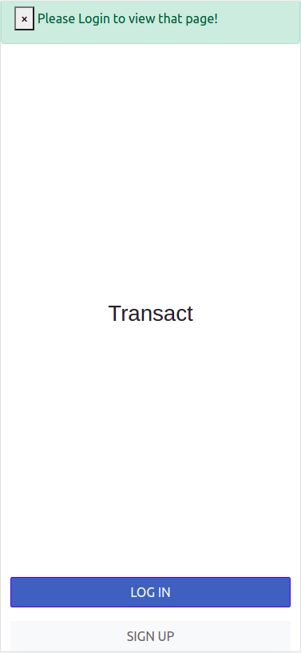
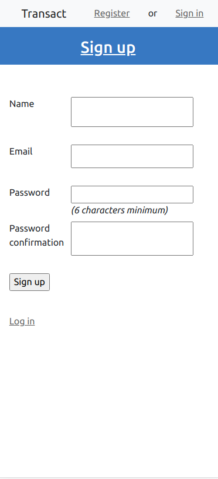
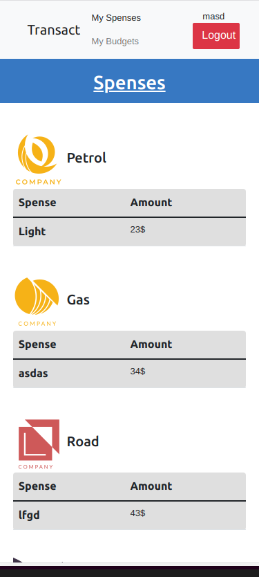
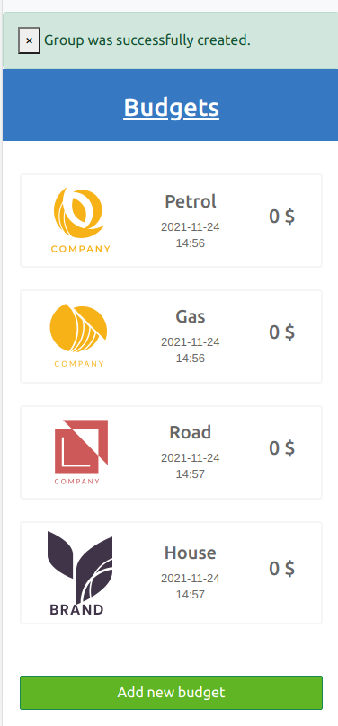
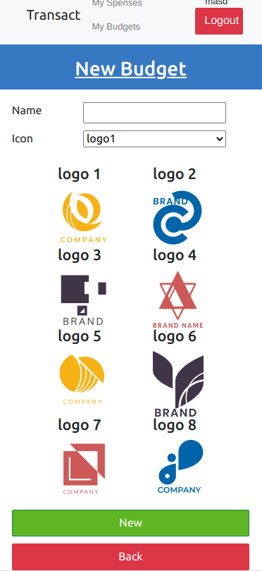

# ror_budget_app


The Budget app keeps track is a mobile web application where you can manage your budget: you have a list of transactions associated with a category, so that you can see how much money you spent and on what.

Features: 
- Register and log in, so that the data is private to them.
- Introduce new transactions associated with a category.
- See the money spent on each category.


### Video

![video] (https://drive.google.com/file/d/1Ju8bL0QMtSG0qKpDTbWxa3Jkqyn0-tOR/view?usp=sharing)











[Recipe App Requirements](https://github.com/microverseinc/curriculum-rails/blob/main/recipe-app/buisness_requirements.md)

### Design

This design is based in the original work of [Gregory Vella](https://www.behance.net/gregoirevella)

=======

## Built With 

- Ruby on Rails
- Rubocop

=======

### Prerequisites

To run this project you must to have ruby installed in your machine. If you don't have it
follow the instructions [here](https://www.ruby-lang.org/en/documentation/installation/)

## Getting Started

If you want a copy of this file go to the github repository and download it from there

- [`git clone https://github.com/Metsanpeitto/ror_budget_app`](https://github.com/Metsanpeitto/ror_budget_app)


### Setup

```cmd
$ git clone  https://github.com/Metsanpeitto/ror_budget_app.git
$ cd ./ror_budget_app
```

### Install gems

```cmd
$ bundle install
```

### Apply migration (only if you generate a new migration file)

```cmd
$ rails db:migrate
```

### Run app

```cmd
$ rails s
```

### Run tests

```cmd
$ rspec spec/
```

### Verify rubocop

```
$ rubocop -A
```

### Install style lint

```
$ npm install --save-dev stylelint@13.x stylelint-scss@3.x stylelint-config-standard@21.x stylelint-csstree-validator@1.x
```

### Run stylelint autofix

```
$ npx stylelint "**/*.{css,scss}" --fix
```

### Instruction for non technical persons

If you are non a technical person you can download the zip file.

- To do that you have to go to the green button that says 'Code' and then press on it.
- Choose the option 'Download Zip' and wait until it download.
- Then you need to decompress it.
- You will need to have Zip compress file software installed in your computer. If you don't have it you can download it from here
  [`https://www.7-zip.org/download.html`](https://www.7-zip.org/download.html)
- Do double click on the Capstone-1.zip and choose a folder where to place all teh decompressed files.
- Once you are done decompressing, you can open the created folder.
- In it you can double click on the index.html file and choose a browser to open it (For example google Chrome Browser).
- Now you should be able to see the project.
- Remember to use the mouse to navigate through the website. Also you can use the keys 'arrow up' and 'arrow down' of your keyboard
  to scroll up and down.

=======

## Author

👤 **Abraham Rodriguez**

- GitHub: [@metsanpeitto](https://github.com/Metsanpeitto)
- Twitter: [@metsanpeitto](https://twitter.com/home)
- LinkedIn: [Abraham Rodriguez](https://www.linkedin.com/in/abraham-rodriguez-3283a319a/)
- Portfolio: [Waldenberg](https://portfolio.waldenberginc.com)

=======

## 🤝 Contributing

Contributions, issues, and feature requests are welcome!

Feel free to check the [issues page](../../issues/).

=======

## Show your support

Give a ⭐️ if you like this project!

=======

## Acknowledgments

- Microverse for giving me this chance
- The amazing code reviewers for making me improve every day :thumbsup:

=======


[](https://creativecommons.org/licenses/by-nc/4.0/)
[](http://creativecommons.org/publicdomain/zero/1.0/)

